I created this tutorial as I could not find a simple and easy to understand method to add OAuth using Vercel functions to [DecapCMS](https://decapcms.org). But in this tutorial I'll also show you how to add DecamCMS to an existing Astro project to edit the site using an admin interface.

## Getting started

For this tutorial we'll need the following:

1. Node.js installed (v22+).
2. A Github and Vercel account (its free).
3. A project in which you want to add DecapCMS. We'll use the [Astro blog template](https://astro.build/themes/details/blog/) for this tutorial.
4. A custom domain (not mandatory but good to have).

Let's get started 

## Setting up the Astro site

### Cloning the starter project

Create a new project with the Astro blog template. You can keep the directory name as `blog`.

```shell
npm create astro@latest -- --template blog
```

After following the steps you'll have the following directory structure.

```
📦blog
 ┣ 📂.astro
 ┣ 📂.vscode
 ┣ 📂public
 ┣ 📂src
 ┣ 📜.gitignore
 ┣ 📜README.md
 ┣ 📜astro.config.mjs
 ┣ 📜package-lock.json
 ┣ 📜package.json
 ┗ 📜tsconfig.json
```

Now, run the project.

```shell
npm dev
```

And go to <http://localhost:4321>. You'll be able to see the site.

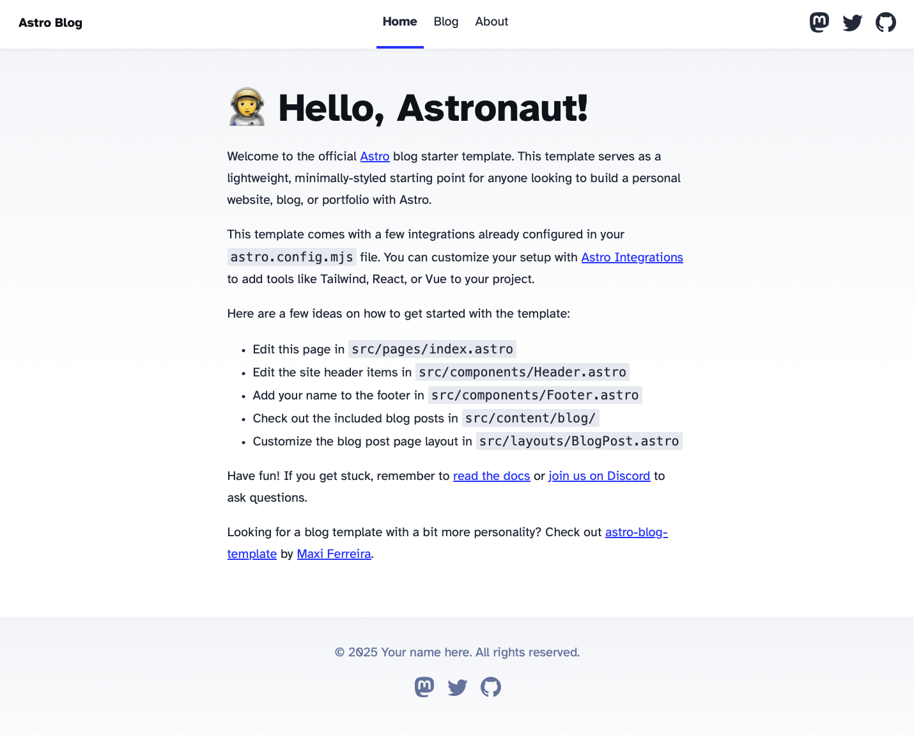

### Adding a post

Now we'll add a post to the site. Go to `src/content/blog` and create a file named `test.md`

```markdown
---
title: "Test 1"
description: "created using code editor"
pubDate: "Mar 27 2025"
heroImage: "/blog-placeholder-4.jpg"
---

This is a test post
```

Save the file and go to the blog section of the site. Open the **Test 1** post.


## Deploying the site

Your site is now ready to be deployed. First we'll push the code to Github and then deploy it using vercel.

### Pushing to Github

Create an [empty repository](https://docs.github.com/en/repositories/creating-and-managing-repositories/creating-a-new-repository) in Github and push the code.

```
git remote add origin <your repository url>
git branch -M main
git push -u origin main
```

### Deploy on vercel

Login to Vercel using Github for easy configuration. Then add a new project. Choose **Import Git Repository.**

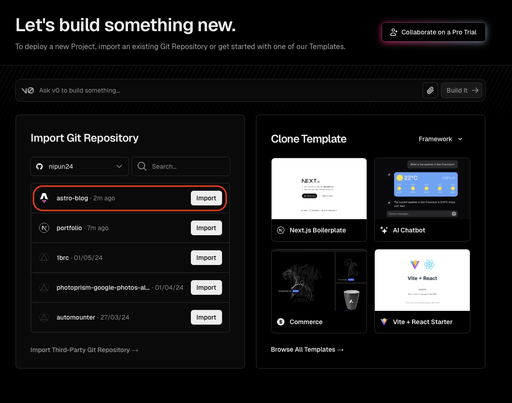

Finally, click **Deploy.**


Wait for the site to get deployed. When the site is deployed click on the url to open the site.

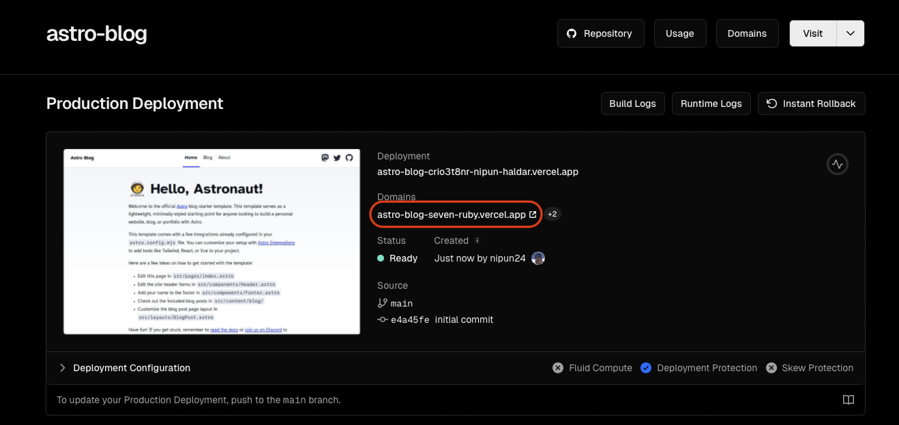

Now if you add a post and push to your repository vercel will automatically build and deploy the site. But this becomes clunky if you do not have access to you machine with the repository setup locally. So the make it easier to add and edit posts well add DecapCMS so that you can edit the blog from anywhere through an interface in your browser only.

## Adding DecapCMS

### Configuring DecapCMS

Create two files inside `public/admin/` 

```
📦public
 ┣ 📂admin
 ┃ ┣ 📜config.yml
 ┃ ┗ 📜index.html
 
```

**index.html**

```html
<!DOCTYPE html>
<html>
  <head>
    <meta charset="utf-8" />
    <meta name="viewport" content="width=device-width, initial-scale=1.0" />
    <meta name="robots" content="noindex" />
    <link href="/admin/config.yml" type="text/yaml" rel="cms-config-url" />

    <title>Content Manager</title>
  </head>
  <body>
    <!-- Include the script that builds the page and powers Decap CMS -->
    <script src="https://unpkg.com/decap-cms@^3.0.0/dist/decap-cms.js"></script>
  </body>
</html>
```

**config.yml**

```yaml
collections:
  - name: "blog" # Used in routes, e.g., /admin/collections/blog
    label: "Blog" # Used in the UI
    folder: "src/content/blog" # The path to the folder where the documents are stored
    create: true # Allow users to create new documents in this collection
    fields: # The fields for each document, usually in frontmatter
      - { label: "Title", name: "title", widget: "string" }
      - { label: "Description", name: "description", widget: "string" }
      - { label: "Publist date", name: "pubDate", widget: "datetime" }
      - { label: "Hero image", name: "heroImage", widget: "string" }

media_folder: "src/assets/images" # Location where files will be stored in the repo
public_folder: "src/assets/images" # The src attribute for uploaded media

backend:
  name: github
  repo: <owner-name>/<repo-name>
  branch: main
```

Now open <http://localhost:4321/admin/index.html> and click **Login with GitHub**.

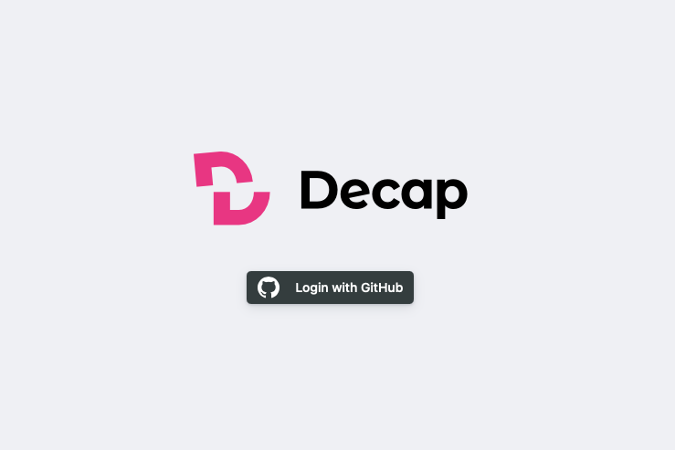

If everything worked you will be able to see all your posts.

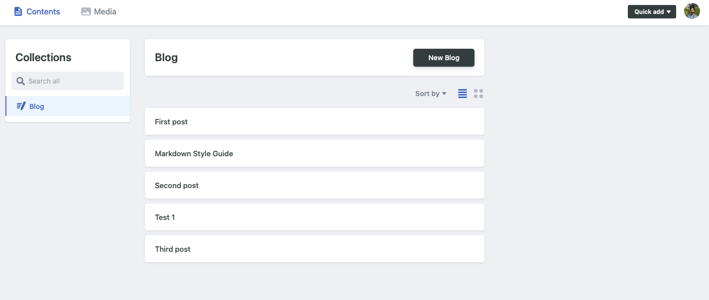

### Editing a post

Open the post we just and edit it. When you are done click on **Publish.** DecapCMS will push a commit with the changes to your Github repository and vercel will start the build. Wait for the build to finish and see the changes.

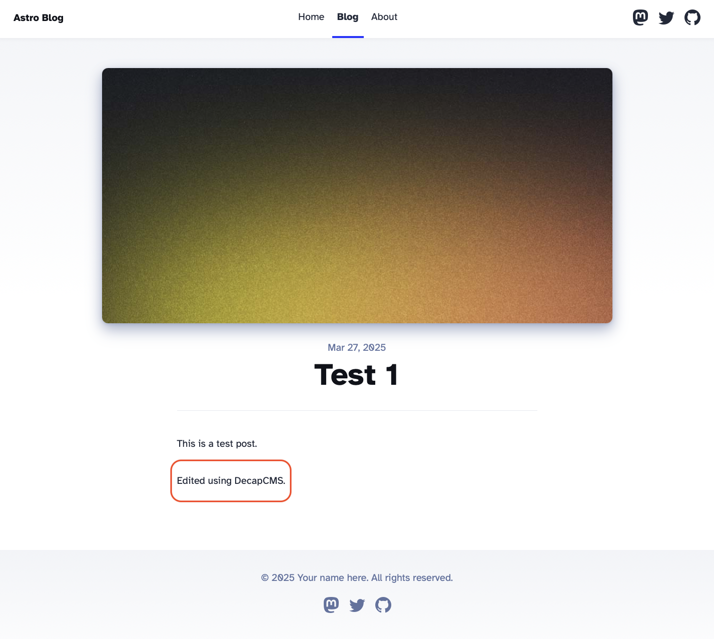

You'll not be able to edit the posts just yet from the public url on vercel. Commit and push all your changes to Github. We'll need to configure the OAuth for production use.

## Creating OAuth for production

### Create Github OAuth application

Login to Github and go to **Profile > Developer Settings > OAuth Apps > New OAuth app.**

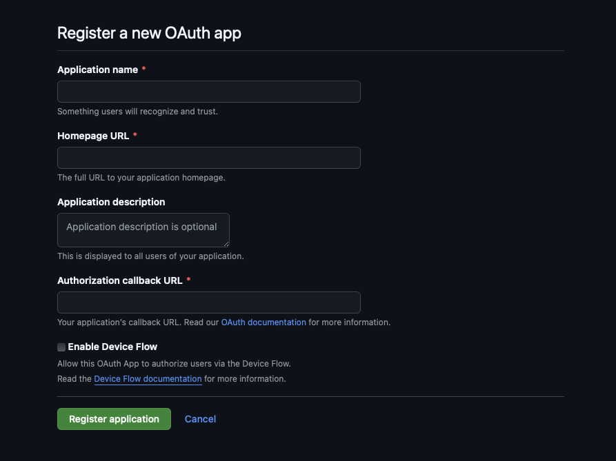

Enter the following values:

1. **Application name:** blog (can be anything)
2. **Homepage URL:** vercel public url of the app
3. **Application Description:** decap oauth (can be anything)
4. **Authorization callback URL:** <vercel public url>/api/callback 
5. **Enable Device Flow:** Keep unchecked

Click **Register.** On the next page copy the **Client ID** and **Client secret.** We'll need it later.

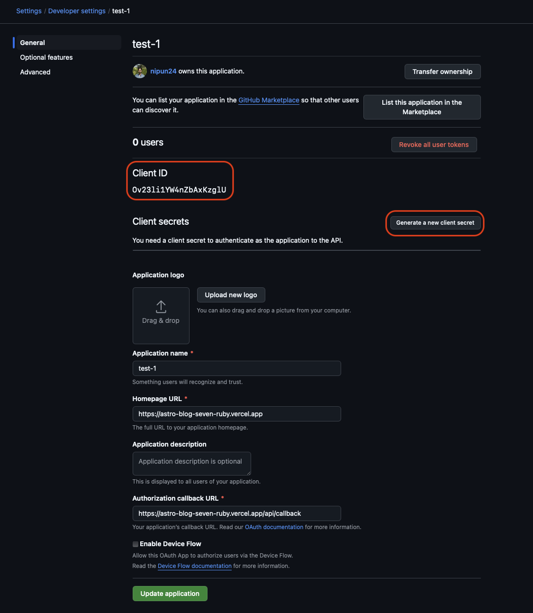

### Adding environment variables in vercel

In your vercel project go to **Settings>Environment variables.**

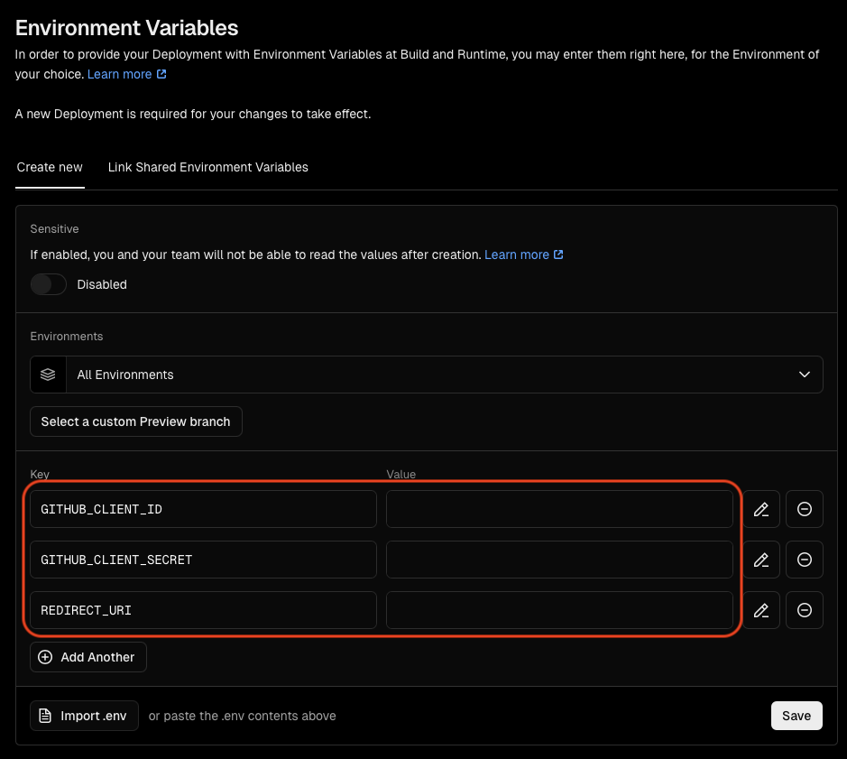

Enter the following values:

1. **GITHUB_CLIENT_ID:** copied from github.
2. **GITHUB_CLIENT_SECRET:** copied from github.
3. **REDIRECT_URI:** The url you used in github authorization callback url.

Click **Save.** 

### Adding API routes in application

We'll use vercel functions to create an API to forward these requests to Github. 

Create a directory named `api` in the root blog `directory`. Create two files `auth.js` and `callback.js`.

**auth.js**

```javascript
export function GET(request, res) {
  const CLIENT_ID = process.env.GITHUB_CLIENT_ID;
  const REDIRECT_URI = process.env.REDIRECT_URI;
  const authURL = `https://github.com/login/oauth/authorize?client_id=${CLIENT_ID}&redirect_uri=${REDIRECT_URI}&scope=repo,user`;
  return Response.redirect(authURL, 307);
}
```

**callback.js**

```javascript
import axios from "axios";

export async function GET(req) {
  const CLIENT_ID = process.env.GITHUB_CLIENT_ID;
  const CLIENT_SECRET = process.env.GITHUB_CLIENT_SECRET;
  const REDIRECT_URI = process.env.REDIRECT_URI;
  const url = new URL(req.url);
  const params = new URLSearchParams(url.search);
  console.log(url, params);
  const code = params.get("code");
  console.log(code);
  if (!code) {
    return new Response(
      `<script>window.opener.postMessage({ error: "Missing code" }, "*"); window.close();</script>`,
    );
  }

  try {
    const tokenResponse = await axios.post(
      "https://github.com/login/oauth/access_token",
      {
        client_id: CLIENT_ID,
        client_secret: CLIENT_SECRET,
        code,
        redirect_uri: REDIRECT_URI,
      },
      { headers: { Accept: "application/json" } },
    );

    const accessToken = tokenResponse.data.access_token;
    const content = JSON.stringify({ token: accessToken, provider: "github" });
    const message = JSON.stringify(`authorization:github:success:${content}`);

    return new Response(
      `
      <html><body><script>
    (function() {
      function recieveMessage(e) {
        console.log("recieveMessage %o", e)
        // send message to main window with da app
        window.opener.postMessage(
          ${message},
          e.origin
        )
      }
      window.addEventListener("message", recieveMessage, false)
      // Start handshare with parent
      console.log("Sending message: %o", "github")
      window.opener.postMessage("authorizing:github", "*")
      })()
    </script></body></html>
    `,
      { headers: { "Content-Type": "text/html" } },
    );
  } catch (error) {
    const content = JSON.stringify(error);
    const message = JSON.stringify(`authorization:github:error:${content}`);
    return new Response(`
      <html><body><script>
    (function() {
      function recieveMessage(e) {
        console.log("recieveMessage %o", e)
        // send message to main window with da app
        window.opener.postMessage(
          ${message},
          e.origin
        )
      }
      window.addEventListener("message", recieveMessage, false)
      // Start handshare with parent
      console.log("Sending message: %o", "github")
      window.opener.postMessage("authorizing:github", "*")
      })()
    </script></body></html>
    `);
  }
}
```

The directory structure will look like this:

```
📦blog
 ┣ 📂api
 ┃ ┣ 📜auth.js
 ┃ ┗ 📜callback.js
```

### Add production and development config

Make a copy of the `public/admin/config.yml` as **config.dev.yml** and **config.prod.yml.**

**config.dev.yml**

```yaml
collections:
  - name: "blog" # Used in routes, e.g., /admin/collections/blog
    label: "Blog" # Used in the UI
    folder: "src/content/blog" # The path to the folder where the documents are stored
    create: true # Allow users to create new documents in this collection
    fields: # The fields for each document, usually in frontmatter
      - { label: "Title", name: "title", widget: "string" }
      - { label: "Description", name: "description", widget: "string" }
      - { label: "Publist date", name: "pubDate", widget: "datetime" }
      - { label: "Hero image", name: "heroImage", widget: "string" }


media_folder: "src/assets/images" # Location where files will be stored in the repo
public_folder: "src/assets/images" # The src attribute for uploaded media


backend:
  name: github
  repo: <owner-name>/<repo-name>
  branch: main

```

**config.prod.yml**

```yaml
collections:
  - name: "blog" # Used in routes, e.g., /admin/collections/blog
    label: "Blog" # Used in the UI
    folder: "src/content/blog" # The path to the folder where the documents are stored
    create: true # Allow users to create new documents in this collection
    fields: # The fields for each document, usually in frontmatter
      - { label: "Title", name: "title", widget: "string" }
      - { label: "Description", name: "description", widget: "string" }
      - { label: "Publist date", name: "pubDate", widget: "datetime" }
      - { label: "Hero image", name: "heroImage", widget: "string" }


media_folder: "src/assets/images" # Location where files will be stored in the repo
public_folder: "src/assets/images" # The src attribute for uploaded media


backend:
  name: github
  repo: <owner-name>/<repo-name>
  branch: main
  base_url: <astro public url>
  auth_endpoint: api/auth

```

Edit the scripts in **package.json** as follows:

```json

  "scripts": {
    ...
    "build": "cp public/admin/config.prod.yml public/admin/config.yml && astro build",
    "develop": "cp public/admin/config.dev.yml public/admin/config.yml && vercel dev",
    ...
  },
```

Now install the following packages

```shell
npm i -g vercel
npm i next@latest axios
```

Check that everything is working locally. You'll asked to login to vercel. Follow the steps to link the existing project on vercel to your local project.

```shell
npm run develop
```

If everything worked you'll still be able to open <http://localhost:4321/admin/index.html>.

## Finally deploying everything

Now we'll finally commit and push everything again. Wait for the deployment to finish on vercel. Then navigate to **<vercel url>/admin/index.html.** If all went good you'll be able to login using Github and see your posts.

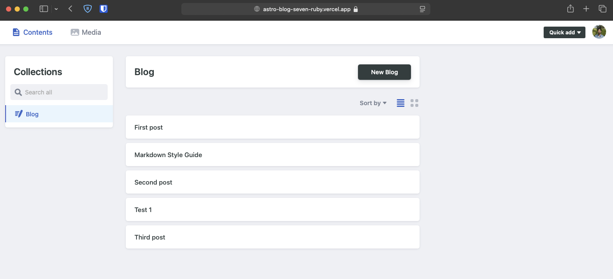

Try to edit a post and publish. The changes will reflected on the site after the build is completed in vercel.

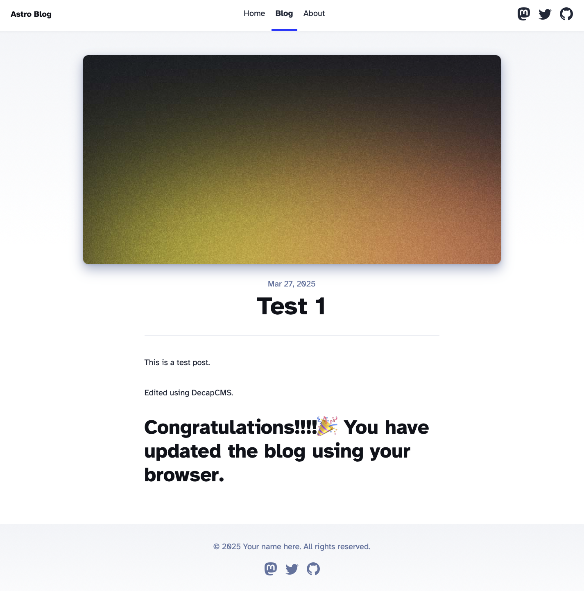

This blog is a bit long. Thank you for making it till the end.🙏
