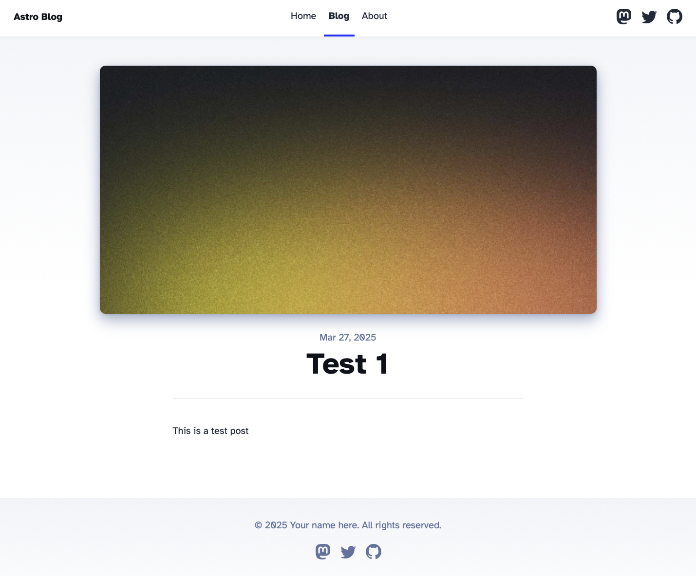

I created this tutorial as I could not find a simple and easy to understand method to add OAuth using Vercel functions to [DecapCMS](https://decapcms.org). But in this tutorial I'll also show you how to add DecamCMS to an existing Astro project to edit the site using an admin interface.

## Getting started

For this tutorial we'll need the following:

1. Node.js installed (v22+).
2. A Github and Vercel account (its free).
3. A project in which you want to add DecapCMS. We'll use the [Astro blog template](https://astro.build/themes/details/blog/) for this tutorial.
4. A custom domain (not mandatory but good to have).

Let's get started 

## Setting up the Astro site

### Cloning the starter project

Create a new project with the Astro blog template. You can keep the directory name as `blog`.

```shell
npm create astro@latest -- --template blog
```

After following the steps you'll have the following directory structure.

```
📦blog
 ┣ 📂.astro
 ┣ 📂.vscode
 ┣ 📂public
 ┣ 📂src
 ┣ 📜.gitignore
 ┣ 📜README.md
 ┣ 📜astro.config.mjs
 ┣ 📜package-lock.json
 ┣ 📜package.json
 ┗ 📜tsconfig.json
```

Now, run the project.

```shell
npm dev
```

And go to <http://localhost:4321>. You'll be able to see the site.


### Adding a post

Now we'll add a post to the site. Go to `src/content/blog` and create a file named `test.md`

```markdown
---
title: "Test 1"
description: "created using code editor"
pubDate: "Mar 27 2025"
heroImage: "/blog-placeholder-4.jpg"
---

This is a test post

```


Save the file and go to the blog section of the site. Open the **Test 1** post.


